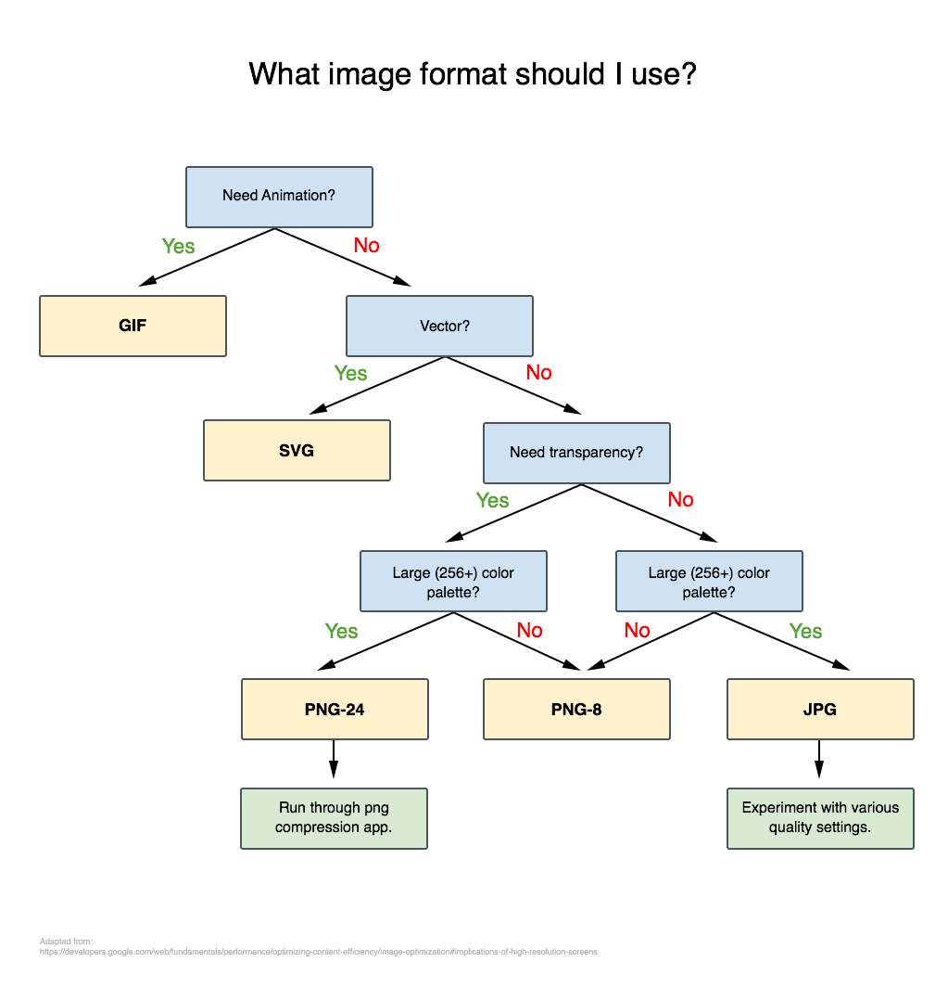

# What Image format should I use?

adapted from: [https://developers.google.com/web/fundamentals/performance/optimizing-content-efficiency/image-optimization#implications-of-high-resolution-screens](https://developers.google.com/web/fundamentals/performance/optimizing-content-efficiency/image-optimization#implications-of-high-resolution-screens)
